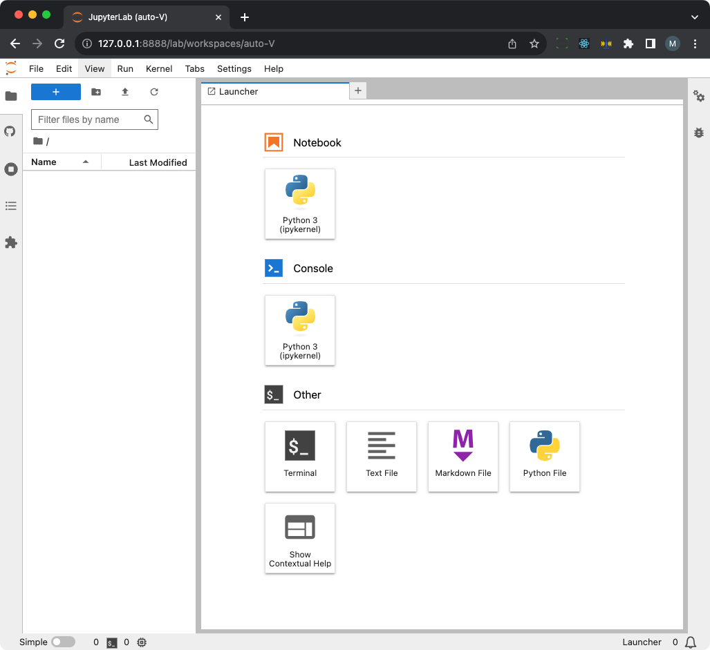

# JupyterLab docker

自定义 JupyterLab docker 镜像。

部署在远程服务器，要求:

- 可以通过 vscode remote 访问服务器
- 服务器已经安装了 docker

通过 vscode remote 进入该服务器，执行命令：

```bash
git clone https://github.com/MarshalW/jupyterlab-docker.git
cd jupyterlab-docker

# 第一次启动会构建 docker image
docker compose up -d

# 查看日志
docker compose logs -f
..
jupyterlab  | [I 2023-10-23 15:18:57.921 ServerApp] Serving notebooks from local directory: /root/notebook
jupyterlab  | [I 2023-10-23 15:18:57.921 ServerApp] Jupyter Server 2.8.0 is running at:
jupyterlab  | [I 2023-10-23 15:18:57.921 ServerApp] http://0941753c3a9b:8888/lab?token=bb03f94f34963874413d90edf3c5b222c7a8c10dd1515094
jupyterlab  | [I 2023-10-23 15:18:57.921 ServerApp]     http://127.0.0.1:8888/lab?token=bb03f94f34963874413d90edf3c5b222c7a8c10dd1515094
jupyterlab  | [I 2023-10-23 15:18:57.922 ServerApp] Use Control-C to stop this server and shut down all kernels (twice to skip confirmation).
jupyterlab  | [C 2023-10-23 15:18:57.925 ServerApp] 
..
```

浏览器访问：http://127.0.0.1:8888/lab?token=bb03f94f34963874413d90edf3c5b222c7a8c10dd1515094



